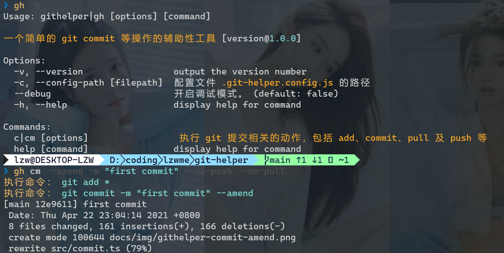

[](https://lzw.me)
[][npm-url]

# @lzwme/git-helper

[![NPM version][npm-badge]][npm-url]
[![node version][node-badge]][node-url]
[![npm download][download-badge]][download-url]
[![GitHub issues][issues-badge]][issues-url]
[![GitHub forks][forks-badge]][forks-url]
[![GitHub stars][stars-badge]][stars-url]
[![minzipped size][bundlephobia-badge]][bundlephobia-url]

一个基于 `Node.js` 的简单的 `git commit` 等操作的辅助性工具。

在中大型前端项目的开发中，为了编码规范与质量保障，基本都会配置 husky、lint-staged 等 githooks 工具来约束 git 提交的规范性检测，如 commitlint、ESLint、StyleLint、prettier、单元测试等等。

这些约束在保障开发提交规范性的同时，也大大的增加了 `git commit` 的执行时间，随着项目开发周期的增长和复杂度的提升，带来的开发体验也会越来越糟糕。

最常见的 `git commit` 动作一般主要为：

```bash
git add *
git commit -m "feat: test"
git pull --rebase
git push
```

那么不如将这个动作写为一个脚本，让它自己飞一会儿。本项目主要就是实现为一个包含这样的功能的小工具。

你也可以结合一些 git 客户端提供的工作流功能一起辅助性配置该流程。

## 安装

```bash
# 全局安装
npm i -g @lzwme/git-helper
# 验证是否成功
gh --help
```



## 使用

### 帮助信息

```bash
githelper --help
githelper commit --help
```

**提示：**

`githelper` 有一个短的别名 `gh`，类似的：

- `githelper commit` 命令也有短别名 `gh cm`、`gh c`
- More...

## 配置文件

配置文件名称为 `.git-helper.config.js`， 默认在当前项目执行目录下，也可以通过命令行参数 `-c` 指定。
它主要用于配置特定项目的确定性参数，例如 `messageReg` 提交注释规范约束、`push` 默认是否执行 push 等。

配置文件是可以缺省的，命令行参数的优先级比它更高。

### 常见使用方式示例

- `githelper commit` 命令常用方式示例：

```bash
# 执行 git commit，包括 add、commit、rebase
gh c -m "feat: test for lzwme"

# 执行 git commit，包括 add、commit、rebase、push
gh c -m "feat: test for lzwme" --push

# 执行 git commit，覆盖上一次的提交(若最近一次提交已推送至远端则失败)
gh c -m "feat: test for lzwme" --amend

# 执行 git commit，覆盖上一次的提交，且不修改注释
gh c --amend

# 执行 git commit，不执行 pull、push
gh c -m "feat: test for lzwme" --no-push --no-pull
```

## 开发

本地二次开发：

```bash
git clone https://github.com/lzwme/git-helper
yarn install
npm link
yarn dev
```

或者 fork 本项目进行代码贡献。

**欢迎贡献想法与代码。**

## License

`@lzwme/git-helper` is released under the MIT license.

该插件由[志文工作室](https://lzw.me)开发和维护。


[stars-badge]: https://img.shields.io/github/stars/lzwme/git-helper.svg
[stars-url]: https://github.com/lzwme/git-helper/stargazers
[forks-badge]: https://img.shields.io/github/forks/lzwme/git-helper.svg
[forks-url]: https://github.com/lzwme/git-helper/network
[issues-badge]: https://img.shields.io/github/issues/lzwme/git-helper.svg
[issues-url]: https://github.com/lzwme/git-helper/issues
[npm-badge]: https://img.shields.io/npm/v/@lzwme/git-helper.svg?style=flat-square
[npm-url]: https://npmjs.org/package/@lzwme/git-helper
[node-badge]: https://img.shields.io/badge/node.js-%3E=_10.0.0-green.svg?style=flat-square
[node-url]: https://nodejs.org/download/
[download-badge]: https://img.shields.io/npm/dm/@lzwme/git-helper.svg?style=flat-square
[download-url]: https://npmjs.org/package/@lzwme/git-helper
[bundlephobia-url]: https://bundlephobia.com/result?p=@lzwme/git-helper@latest
[bundlephobia-badge]: https://badgen.net/bundlephobia/minzip/@lzwme/git-helper@latest
